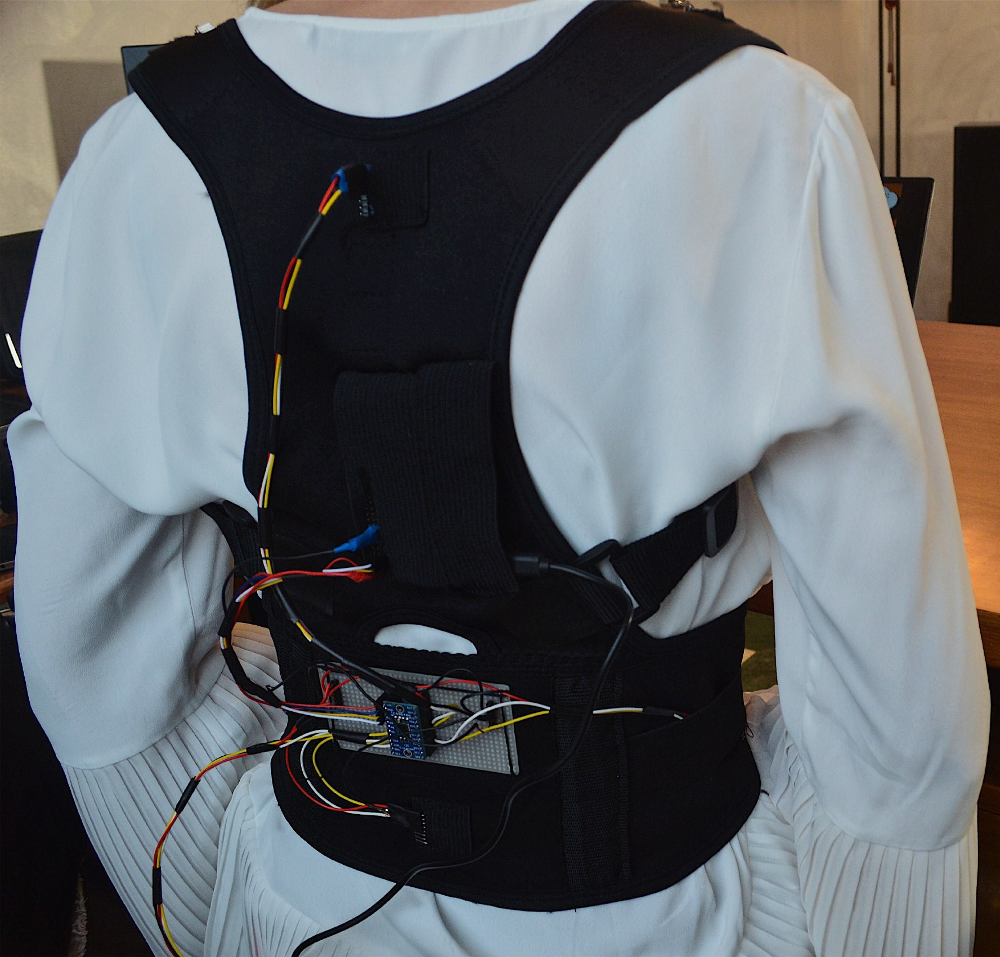

<p>
  
  <i>DiSfida: students at the service of non-profit for disability and social inclusion.<br>A.Y. 2018/2019</i>
</p>

# Aequus
Low cost portable system for interactive balance exercise games for rehabilitation.


## Context
The fear of falling is one of the elements that most limits the active life of subjects who have experienced a fall. There is a strong need for the patient with Multiple Sclerosis, but in reality for many patients with neuromotor diseases and frail elderly people, to minimize the risk of falling, and the associated fear of falling. It is necessary to have low-cost technological solutions that can be used at home that encourage the safe execution of exercises aimed at improving the control of balance, giving awareness to the subject of his own ability and improvements.

## Project design
<p align="center">
  
</p>

Aequus is a proof of concept solution composed by a [Raspbery Pi](https://www.raspberrypi.org/) that acts like a master to control 5 [MPU6050](https://invensense.tdk.com/products/motion-tracking/6-axis/mpu-6050/) sensors disposed along a back strap. The sensors data are then sent over the Wi-Fi network (to avoid annoying cables around the patient) to a computer(or in future, a mobile phone app), where the patient can plays various interactive games that help in rehabilitation purpose.

## Usage information

- All the files in /project-files/Server have to be uploaded to a Raspberry Pi (version ≥ 3)
- All the files in /project-files/Client have to be kept on your PC

- Install all the requirements in requirements.txt on both Raspberry and your PC
    ```sh
    $ pip3 install -r requirements.txt
    ```
- Connect all the sensors to a I2C Mux Expander and place them along a back strap

- Connect both your PC and Raspberry Pi to the same Wi-Fi network, or setup the Raspberry Pi as a [standalone access point](https://thepi.io/how-to-use-your-raspberry-pi-as-a-wireless-access-point/) (no internet connection needed)

- Change the serverName in RPI_client.py according to your Raspberry Pi IP address, just type on a terminal:
   ```sh
    $ ifconfig
    ```
    then search under the wifi voice: "inet"

- Start the server on the Raspberry Pi to initialize sensor readings
     ```sh
    $ python3 RPI_server.py
    ```

- Run DiSfida_APP.py on your pc
     ```sh
    $ python3 DiSfida_APP.py
    ```
    - click on training
    - choose the preferences (Duration, Difficulty)
    - click on start
    - wait the connection of all the sensors
    - play!

## Demo

<p align="center">
  
  
</p>

<p align="center">
  
</p>

## Disclaimer
The project is a basic proof of concept developed to be presented to Italian hospitals, therefore some parts may be written in italian or not yet completed for a fully functionality.

## Credits

**Aequus** is the winning project of the DiSfida contest held by Politecnico di Milano during March/April 2019.

All the credits of the development part of this project go to the authors:
- [Manuel Carzaniga](https://github.com/Manucar)
- [Lorenzo Gualniera](https://github.com/Gualor)

## Contacts

If you have any issues and/or questions please don't hesitate to contact us with the e-mail contacts provided below:
- carzaniga.manuel@gmail.com
- lorenzo.gualniera@gmail.com

